# Xây Dựng Ứng Dụng Nhận Diện Vật Thể qua mô hình CNN

<p align="center">
  <a href="https://github.com/notobo15/object_detection_with_CNN/releases/tag/v1.1.0">
    
  </a>
  <a href="https://github.com/notobo15/object_detection_with_CNN/releases/tag/v1.1.0">
    
  </a>
  <a href="https://opensource.org/licenses/MIT">
    
  </a>
</p>

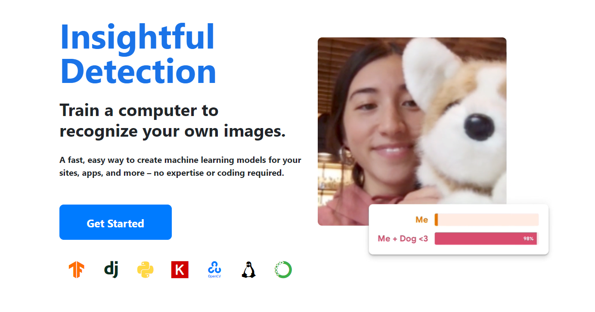

## [Link File Báo Cáo Latex](https://www.overleaf.com/read/ggttmjkvswmt#9b40b4)

## Table of Contents

- [Xây Dựng Ứng Dụng Nhận Diện Vật Thể qua mô hình CNN](#xây-dựng-ứng-dụng-nhận-diện-vật-thể-qua-mô-hình-cnn)
  - [Link File Báo Cáo Latex](#link-file-báo-cáo-latex)
  - [Table of Contents](#table-of-contents)
  - [Intro](#intro)
  - [Features](#features)
  - [Browser Support](#browser-support)
  - [Demo](#demo)
    - [New Project Page](#new-project-page)
    - [1. Standard Training Page](#1-standard-training-page)
      - [1.1 Choose Dataset with available](#11-choose-dataset-with-available)
      - [1.2 View Image Full Screen](#12-view-image-full-screen)
      - [1.3 Setting Form](#13-setting-form)
      - [1.4 Select the total number of images for each class](#14-select-the-total-number-of-images-for-each-class)
      - [1.5 Choose images to upload](#15-choose-images-to-upload)
      - [1.6 Prediction and reult](#16-prediction-and-reult)
    - [2. Custom Training Page](#2-custom-training-page)
      - [2.1 Add class and add images to each class](#21-add-class-and-add-images-to-each-class)
      - [2.2 Prediction and reult](#22-prediction-and-reult)
      - [2.3 Export the model to save as a zip file](#23-export-the-model-to-save-as-a-zip-file)
    - [3. Import Model Training Page](#3-import-model-training-page)
      - [3.1 Upload the trained model](#31-upload-the-trained-model)
      - [3.2 Import Model Training Page](#32-import-model-training-page)
  - [Prerequisites](#prerequisites)
  - [Installing](#installing)
    - [Step 1: Clone this repository](#step-1-clone-this-repository)
    - [Step 2: Install dependencies](#step-2-install-dependencies)
    - [Step 3: Run the server](#step-3-run-the-server)
  - [Authors](#authors)
  - [Copyright and Licenses](#copyright-and-licenses)

## Intro

- **Quick and Easy Model Creation**: Quickly create machine learning models for your website with ease.
- **Powerful CNNs for Computer Vision**: Use Convolutional Neural Networks to accurately recognize and classify objects in images.
- **MobileNet for Speed and Accuracy**: Employ MobileNet architecture for fast and efficient image recognition, even on mobile devices.

## Features

- **New Training with Available Data**
  - Select dataset: CIFAR-10, MNIST, Flowers, etc.
  - Set parameters: epochs, test size, patch sizes, loss, optimizer.
  - Start the training process.
  - Prediction: use the trained model to classify new images.
  - Export model: allows exporting the model after training for use outside the website or for storage.

- **Create and Train with Personal Dataset**
  - Allows users to create and upload their own dataset.
  - Training and prediction similar to the available dataset.
  - Export model: users can export the trained model for use outside the website or for storage.

- **Import and Use Trained Model**
  - Import a pre-trained model.
  - Prediction: upload an image and predict the outcome.

## Browser Support

 |  |  |  |  |  |
--- | --- | --- | --- | --- | --- |
Latest ✔ | Latest ✔ | Latest ✔ | Latest ✔ | Latest ✔ | 11 ✔ |

## Demo

### New Project Page

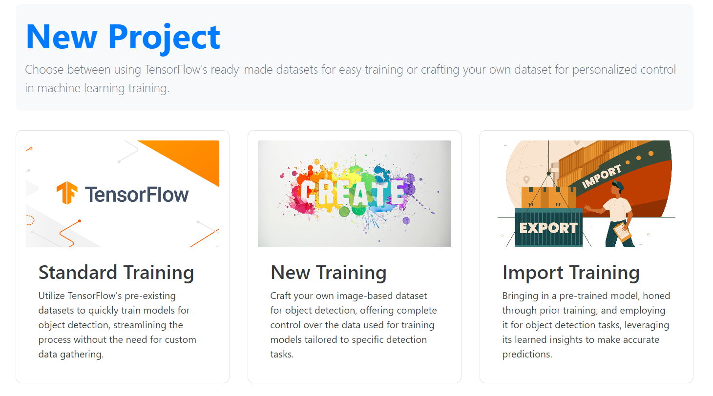

### 1. Standard Training Page

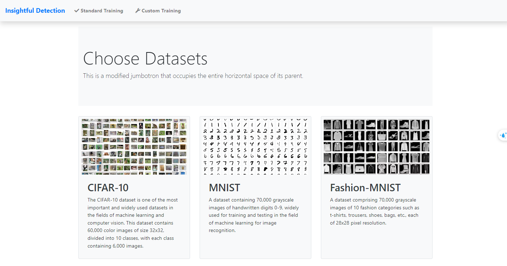

#### 1.1 Choose Dataset with available

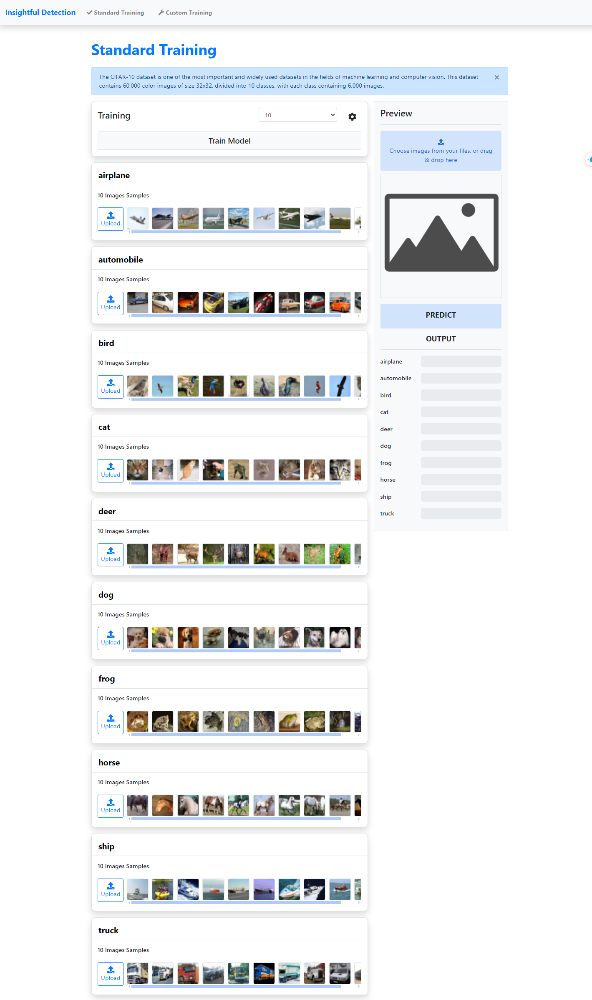

#### 1.2 View Image Full Screen

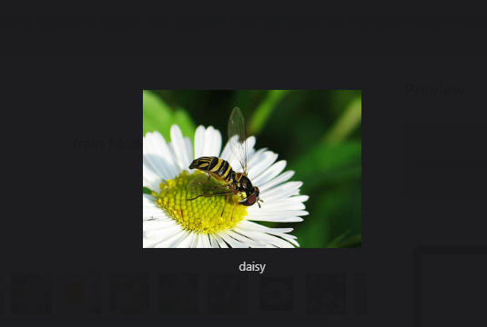

#### 1.3 Setting Form


#### 1.4 Select the total number of images for each class


#### 1.5 Choose images to upload


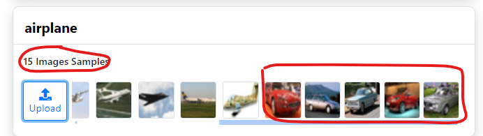

#### 1.6 Prediction and reult

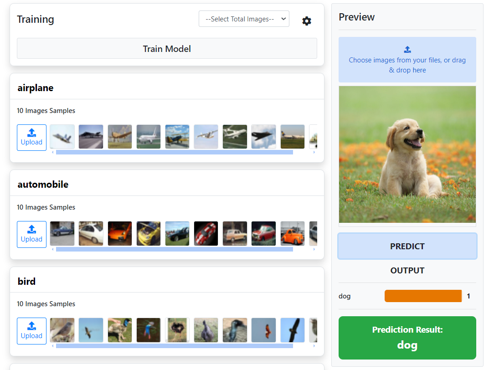

### 2. Custom Training Page

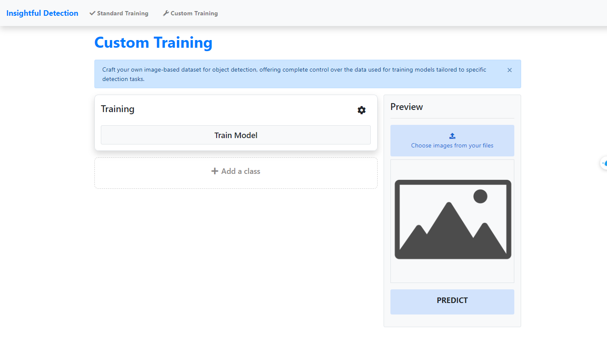

#### 2.1 Add class and add images to each class

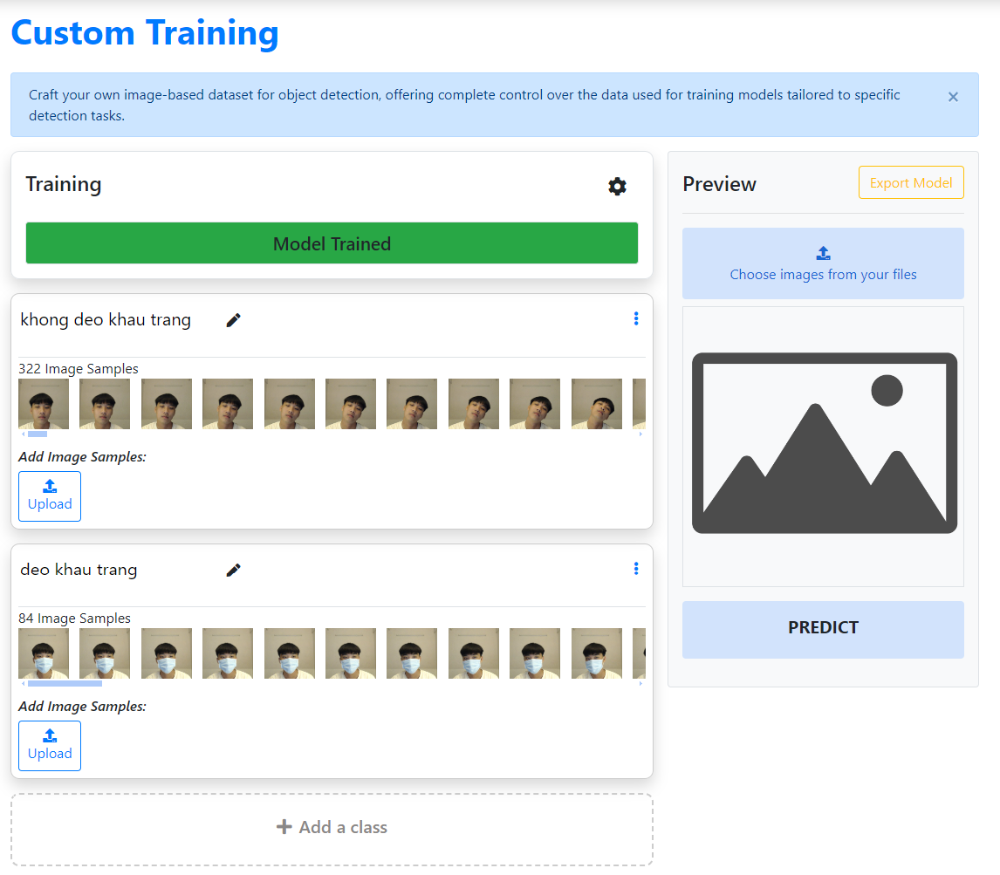

#### 2.2 Prediction and reult

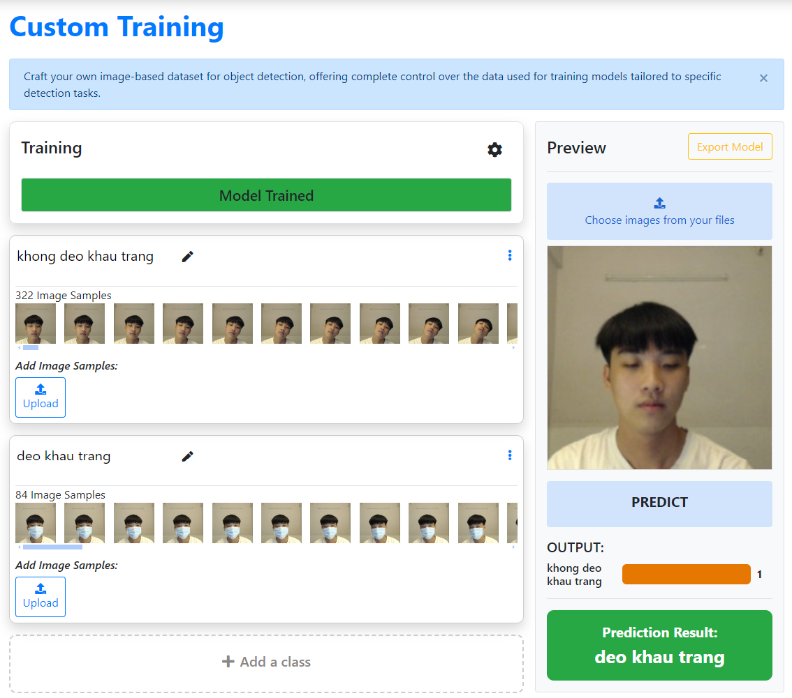

#### 2.3 Export the model to save as a zip file

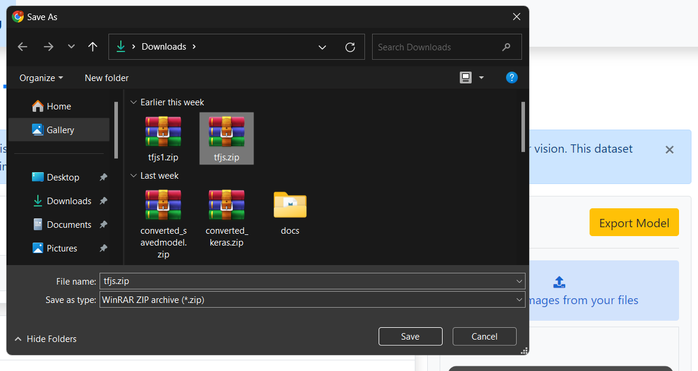
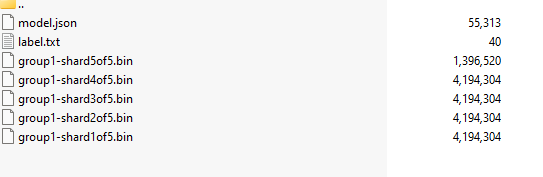

### 3. Import Model Training Page

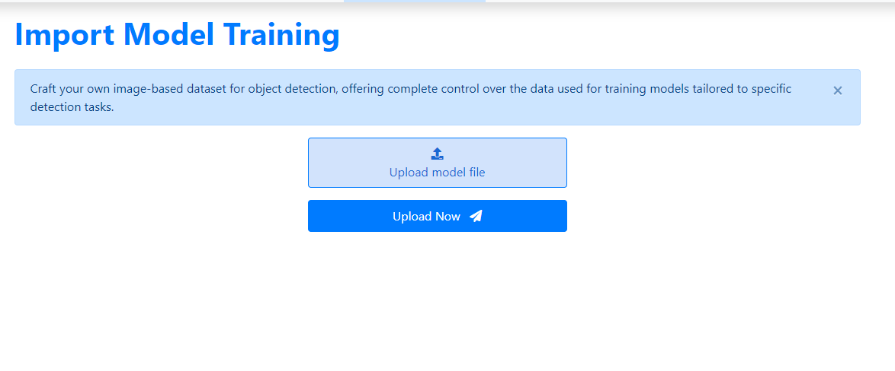

#### 3.1 Upload the trained model

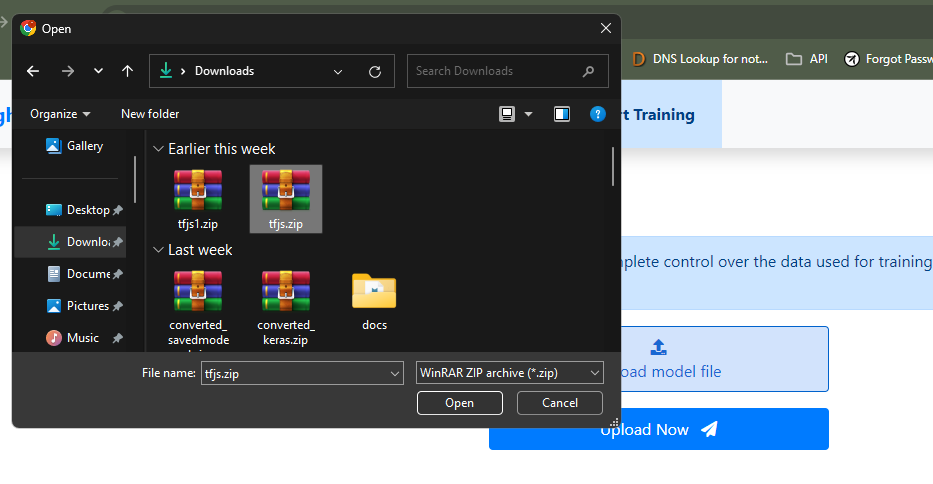

#### 3.2 Import Model Training Page

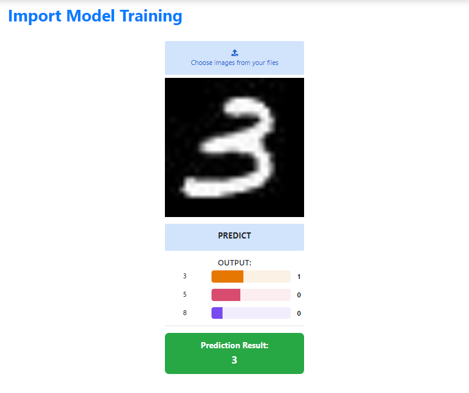
  
## Prerequisites

**Due to some packages no longer being supported on Windows, to prevent unexpected errors during installation, the minimum configuration is as follows**

```bash
1. Operating System: Linux
2. Python Version: >=3.7
3. Tensorflow Version: >=2.4
```

## Installing

### Step 1: Clone this repository

- [Download the latest release](https://github.com/notobo15/object_detection_with_CNN/releases/tag/v1.1.0)

- Clone the repo: `git clone https://github.com/notobo15/object_detection_with_CNN.git`

### Step 2: Install dependencies

```bash
cd object_detection_with_CNN
pip install -r setup.txt
```

### Step 3: Run the server

```bash
python manage.py runserver
```

## Authors

- Nguyen Thanh Binh
- Ngo Kieu Lam

## Copyright and Licenses

Code released under the [MIT License](https://github.com/notobo15/object_detection_with_CNN/blob/v1.1.0/LICENSE).
